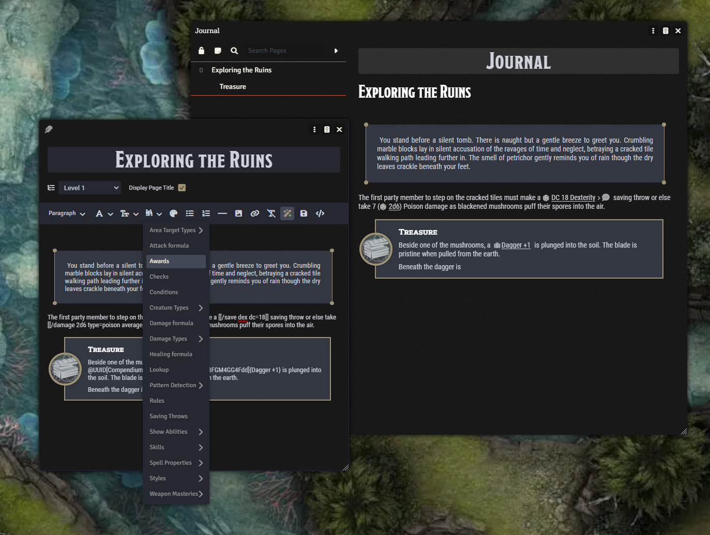

# D&D - Easy Reference

    

Adds a menu to ProseMirror containing enrichers, references, and stylish journal HTML blocks for the D&D system that can be injected directly into the editor.

## New Edition

This module was originally created by [Padhiver](<https://github.com/Padhiver>). It is now under active development and longterm maintenance by [kgar](<https://github.com/kgar>), with Padhiver and others as collaborators.

The [previous version](<https://github.com/Padhiver/dnd-easy-reference>) and [its releases](<https://github.com/Padhiver/dnd-easy-reference/releases>).

## Demo

https://github.com/user-attachments/assets/6a8b0f9f-9322-4aeb-917f-670c85a47d3b

---

## Supported languages
- French
- English
- Italian
- Polish
- Russian
- Simple Chinese
- Português (Brasil)
- Submit a PR to add your own! (Hoping to integrate Libro Weblate soon)

## Supported languages for Pattern Detection
- French
- English
